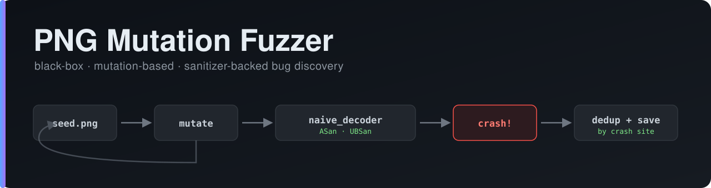
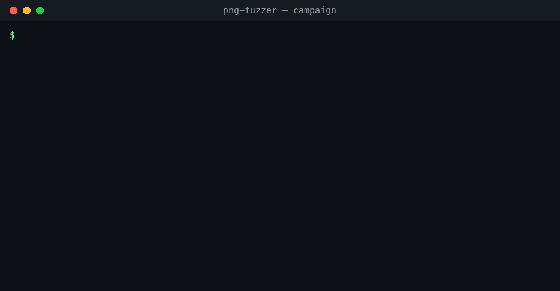

<p align="center">
  
</p>

<p align="center">
  <a href="https://github.com/ashtherz/png-fuzzer/actions/workflows/ci.yml">
    </a>
  
  
  
  
</p>

# PNG Mutation Fuzzer

A small, readable, **black-box mutation fuzzer** for PNG image decoders — in the
same spirit as AFL++ / libFuzzer, but stripped down to its essentials so you can
read every line and understand *why* it finds bugs.

It generates malformed PNG files, feeds them to a decoder compiled under
[AddressSanitizer](https://clang.llvm.org/docs/AddressSanitizer.html) and
UndefinedBehaviorSanitizer, and then **detects, locates, deduplicates, and
records** the memory-safety bugs they trigger.

<p align="center">
  
</p>

> **Scope.** The target decoder (`target/naive_decoder.c`) is a deliberately
> vulnerable decoder written for this project, modelling real
> [CWE](https://cwe.mitre.org/) weakness classes. This demonstrates bug
> *discovery* end-to-end — it is **not** a scan of production libpng. Everything
> here is for education and authorized security testing only.

---

> 📖 **New here?** The [illustrated walkthrough in `docs/GUIDE.md`](docs/GUIDE.md)
> tours the whole pipeline step by step (with GIFs) — a good starting point and a
> ready-made basis for a write-up. There's also a
> [project website](https://ashtherz.github.io/png-fuzzer/) (GitHub Pages).

## Why this exists

Real fuzzers (AFL++, libFuzzer, honggfuzz) are coverage-guided and heavily
engineered. That power hides the core idea. This project keeps the pipeline —
**mutate → execute → detect → deduplicate → record** — but makes every stage
about 100 lines of plain Python/C you can actually read, so it's useful for
learning how file-format fuzzing works and for a security course write-up.

---

## The pipeline

```
corpus/seed.png ─▶ mutator ─▶ malformed.png ─▶ naive_decoder (ASan/UBSan) ─▶ crash?
                     ▲                                                         │
                     └──────────────────── loop ──────────────────┐           ▼
                                                                   └── save input + notes + SUMMARY.md
```

| Component | File | Job |
|-----------|------|-----|
| Seed generator | [`corpus/make_seed.py`](corpus/make_seed.py) | Builds a valid PNG byte-by-byte (no imaging library). |
| Structure inspector | [`src/png_inspect.py`](src/png_inspect.py) | Prints a PNG's chunk table; tolerant of malformed input. |
| Mutation engine | [`src/mutator.py`](src/mutator.py) | Named corruption strategies + a `havoc` mode that stacks them. |
| Vulnerable target | [`target/naive_decoder.c`](target/naive_decoder.c) | Naive PNG decoder with planted bugs, built under sanitizers. |
| Fuzzing harness | [`src/fuzz.py`](src/fuzz.py) | The driver loop: mutate → run → detect → dedup → save. |

---

## Requirements

- A C compiler with AddressSanitizer + UBSanitizer support: **`gcc` or `clang`**
  (on macOS, the system `cc`/`clang` works out of the box).
- **Python 3** — standard library only, no `pip install` needed.
- **Linux or macOS** (the harness relies on process signals and sanitizer output).

There are no third-party dependencies. If you can compile C and run Python, you
can run this.

---

## Quick start

```bash
# 1. Build the vulnerable target (AddressSanitizer + UBSan)
cd target && make && cd ..

# 2. Generate a valid seed PNG
python3 corpus/make_seed.py            # writes corpus/seed.png

# 3. (optional) Look at the seed's structure
python3 src/png_inspect.py corpus/seed.png

# 4. Run a fuzzing campaign
python3 src/fuzz.py fuzz --iters 4000 --seed 0

# 5. Read the results
cat crashes/SUMMARY.md

# 6. Reproduce any saved crash (prints the full sanitizer report)
python3 src/fuzz.py repro crashes/001_*.png
```

> **Prefer `make`?** `make build`, `make seed`, then `make fuzz` do steps 1, 2
> and 4 — run `make help` to see every shortcut.

---

## Example run

A campaign with `--seed 0` is fully deterministic — it finds all four planted
bugs within the first ~20 iterations, then spends the rest of the run
re-triggering them and deduplicating:

```text
$ python3 src/fuzz.py fuzz --iters 700 --seed 0
[     1] NEW  #001  heap-buffer-overflow naive_decoder.c:103   via lie_length: chunk#1 IDAT len 132 -> 4294967295
[     7] NEW  #002  oob-index            naive_decoder.c:48    via havoc[dup_chunk: chunk#2 IEND duplicated | ihdr_field: colou...
[    16] NEW  #003  oob-index            naive_decoder.c:86    via havoc[ihdr_field: width = 256 (0x100) | byte_flip: byte 29 ...
[    19] NEW  #004  heap-buffer-overflow naive_decoder.c:69    via havoc[lie_length: chunk#0 IHDR len 13 -> 16777215 | ihdr_...
...
done in 82.7s   crashing runs: 317   unique bugs: 4
```

Every line names the mutation that produced the crash, so a finding is always
traceable to the exact byte-level change that caused it. The resulting
`crashes/SUMMARY.md`:

| # | crash site | function | bug type | CWE | root cause |
|---|------------|----------|----------|-----|------------|
| 001 | `naive_decoder.c:103` | `chunk_checksum` | heap-buffer-overflow | CWE-125 | Trusts a chunk length from the file when reading data. |
| 002 | `naive_decoder.c:48` | `ihdr_channel_lookup` | oob-index | CWE-125/129 | Unvalidated colour-type byte used directly as an array index. |
| 003 | `naive_decoder.c:86` | `fill_row_scratch` | oob-index | CWE-121/787 | File-controlled count writes into a fixed 64-byte stack buffer. |
| 004 | `naive_decoder.c:69` | `ihdr_alloc_and_fill` | heap-buffer-overflow | CWE-190→787 | 32-bit width narrowed to 16-bit when sizing the pixel buffer. |

---

## Command-line reference

### `fuzz` — run a campaign

```bash
python3 src/fuzz.py fuzz [options]
```

| Flag | Meaning |
|------|---------|
| `--iters N` | Number of mutate-and-run iterations (default 6000). |
| `--seed N` | RNG seed; fixes the **exact** mutation sequence (reproducibility). |
| `--strategy NAME` | Force one mutation strategy instead of the weighted mix. |
| `--timeout SECS` | Per-run timeout; hangs are recorded as possible DoS findings. |
| `--seeds DIR` | Custom seed-corpus directory (default `corpus/`). |
| `--out DIR` | Output directory for crashes (default `crashes/`). |
| `--target PATH` | Path to the built decoder (default `target/naive_decoder`). |

Strategy names: `bit_flip`, `byte_flip`, `truncate`, `lie_length`, `ihdr_field`,
`dup_chunk`, `remove_chunk`, `corrupt_crc`.

### `repro` — replay a saved crash

```bash
python3 src/fuzz.py repro crashes/001_heap-buffer-overflow.png
```

Re-runs the target on the saved input and prints the full sanitizer report. A
saved crashing input re-triggers its bug independently of the RNG, so findings
survive across machines and runs.

### Inspecting any file (valid or broken)

```bash
python3 src/png_inspect.py <file>
```

---

## How each stage works

### 1. The seed — everything understood
`make_seed.py` writes the 8-byte PNG signature, then the `IHDR`, `IDAT`, and
`IEND` chunks by hand, computing correct lengths and CRC-32s itself. Because no
imaging library is involved, we know exactly what a *correct* file looks like —
which is the baseline the mutator then corrupts.

A PNG is a signature followed by chunks, each:

```
length (4 bytes) | type (4 ASCII) | data (length bytes) | CRC (4 bytes)
```

Every `length`, `type`, and `data` field is attacker-controlled — so each is a
place a bug can live. The mutations and the planted bugs both target these trust
boundaries.

### 2. The mutations — named and traceable
Every mutation reports exactly what it changed, so a crash is always traceable to
the byte-level change that caused it.

- **Dumb (format-agnostic):** `bit_flip`, `byte_flip`, `truncate`.
- **Structure-aware (PNG-aware):** `lie_length` (declare more/fewer bytes than
  present), `dup_chunk`, `remove_chunk`, `ihdr_field` (overwrite width / height /
  bit-depth / colour-type with a boundary value), `corrupt_crc`.

The dispatcher weights effort toward the structure-aware strategies — they reach
bugs random bit-flipping almost never does. **`havoc`** mode stacks several
mutations onto one input. All randomness flows through a **seeded RNG**, so a run
is exactly reproducible.

### 3. The target — bugs that model real CWE classes
`naive_decoder.c` is written naively on purpose and trusts values straight from
the file. Each bug lives in its own function so a crash points at exactly one
weakness:

| Function | Bug class | CWE | Root cause |
|----------|-----------|-----|------------|
| `chunk_checksum` | Heap over-read | CWE-125 | Trusts a chunk `length` when reading. |
| `fill_row_scratch` | Stack buffer overflow | CWE-121 / CWE-787 | File-controlled count writes into a fixed 64-byte stack buffer. |
| `ihdr_channel_lookup` | OOB read via bad index | CWE-125 / CWE-129 | Unvalidated colour-type used directly as a table index. |
| `ihdr_alloc_and_fill` | Integer narrowing → heap OOB write | CWE-190 → CWE-787 | 32-bit width truncated to 16-bit when sizing the buffer. |

Built with `-fsanitize=address,undefined`, the sanitizers place red-zones around
memory and abort on the first violation — turning silent corruption into a
deterministic, *located* crash.

### 4. The harness — detect, deduplicate, record
`fuzz.py` runs the loop. A run is a **crash** when the target is killed by a
signal *or* prints a sanitizer report; an optional `--timeout` records hangs.

**Deduplication is by crash *site*** — the source `file:line` the sanitizer
blames. A single shallow bug is hit thousands of times, so without dedup the
output is unusable.

> **Known pitfall (solved).** An early version keyed the crash signature on the
> sanitizer's full message text — which embeds the faulting **memory address**.
> Addresses change every run (ASLR), so identical bugs looked unique (dozens of
> false "uniques" for a handful of real bugs). Keying on the stable crash *site*
> instead is the correct signature. This fuzzer parses the site from the
> sanitizer's `SUMMARY:` line.

---

## Output artifacts

Findings land in `crashes/`. Per unique crash:

| File | Contents |
|------|----------|
| `NNN_<bugtype>.png` | The exact input that triggered it — reproducible forever. |
| `NNN_<bugtype>.txt` | The mutation that produced it, the sanitizer report, a reproduce command. |
| `crashes/SUMMARY.md` | Table of all unique findings (site, function, CWE, times-hit, root cause). |

---

## Reproducibility

- A fixed `--seed` replays the **exact same** sequence of mutations.
- Every saved crashing input re-triggers its bug independently of the RNG, so
  findings survive across machines and runs.

---

## Seeing that the bugs are *silent* without a sanitizer

Build the optimized, non-sanitized target and feed it an input with a **mild**
out-of-bounds read (a chunk length that lies just past the real data):

```bash
cd target && make release && cd ..

# Craft an input whose IDAT length over-reads by ~40 bytes, then run both builds:
python3 - <<'PY'
import struct, zlib
sig=b"\x89PNG\r\n\x1a\n"
def chunk(t,d): return struct.pack(">I",len(d))+t+d+struct.pack(">I",zlib.crc32(t+d)&0xffffffff)
raw=bytearray()
for y in range(8):
    raw.append(0)
    for x in range(8): raw+=bytes([(x*32)&0xff,(y*32)&0xff,((x+y)*16)&0xff])
idat=zlib.compress(bytes(raw),9)
ih=chunk(b"IHDR",struct.pack(">IIBBBBB",8,8,8,2,0,0,0))
bad=struct.pack(">I",len(idat)+40)+b"IDAT"+idat+struct.pack(">I",0)   # length lies +40
open("/tmp/mild.png","wb").write(sig+ih+bad+chunk(b"IEND",b""))
PY

./target/naive_decoder         /tmp/mild.png   # ASan: ABORTS with heap-buffer-overflow
./target/naive_decoder_release /tmp/mild.png   # release: prints "decoded ok" — corruption is INVISIBLE
```

The whole point of the sanitized build: it makes invisible memory corruption
loud and precise. (Inputs with a *large* over-read may `SIGSEGV`/`SIGBUS` even in
release once they walk into an unmapped page — it's the small, quiet corruption
that a sanitizer is really needed to catch.)

---

## Seeds & growing the corpus

The fuzzer is **seed-agnostic**: it loads every `*.png` in the seed directory, so
you can point it at any corpus with `--seeds`:

```bash
python3 src/fuzz.py fuzz --seeds path/to/corpus --iters 6000 --seed 0
```

Because it's black-box, the seeds *are* the reach — more diverse seeds exercise
more code paths, so growing the corpus is the single biggest lever on results.
Good sources: real-world sample files, files with unusual-but-valid structure
(different colour types, bit depths, ancillary chunks), and **auto-generated
seeds**.

For that last one, [**AutoCorpus**](https://github.com/user1342/AutoCorpus) by
[@user1342](https://github.com/user1342) is a neat fit — it's an LLM-backed tool
that *generates corpus files for fuzzing* from a text prompt and/or existing
samples. That's precisely the "give me a richer seed set" job, and it slots in
right before this fuzzer's mutation stage:

```bash
# 1. (in AutoCorpus) generate a folder of seed inputs, e.g. ./autocorpus_out
# 2. mutate them here — no other change needed:
python3 src/fuzz.py fuzz --seeds autocorpus_out --iters 6000 --seed 0
```

Or hand the folder to the one-command helper — it builds the target if needed,
**sanity-checks how many files actually parse as PNG** (useful for generic /
generated seeds), and runs the campaign:

```bash
scripts/run_campaign.sh autocorpus_out 6000 0
# ==> seed check: 12 *.png file(s), 9 with a valid PNG signature
#     note: 3 file(s) are not PNG-signed; ... inspect with png_inspect.py
```

…or the same thing through the top-level `make` shortcut:

```bash
make fuzz SEEDS=autocorpus_out ITERS=6000 SEED=0
```

> **Honest caveat.** AutoCorpus shines on structured, *human-readable* formats
> (JSON, XML, config files); PNG is a binary format, so treat anything it
> produces as raw starting material and run it through
> [`png_inspect.py`](src/png_inspect.py) to see which files actually parse as
> PNG. The idea generalises regardless of format: **seed generation and seed
> mutation are complementary stages of the same pipeline** — AutoCorpus makes
> seeds, this fuzzer mutates them.

## Non-goals / limitations

- **Black-box, not coverage-guided.** Unlike AFL++/libFuzzer, it gets no coverage
  feedback and does not learn which mutations reach new code.
- **Small seed corpus.** Reachable bugs are bounded by seed diversity — see
  [Seeds & growing the corpus](#seeds--growing-the-corpus) for how to feed it a
  richer one (including auto-generated seeds).
- **Self-authored target.** Bugs are planted to model real CWE classes; this is a
  demonstration of the pipeline, not an audit of a production decoder.
- **No minimization.** Crashing inputs are saved as-is, not reduced.

---

## Representative campaign

<!-- CAMPAIGN_STATS -->
_(Numbers from one run on the author's machine, `--iters 1500 --seed 0`; regenerate
your own — a fixed `--seed` reproduces the exact sequence.)_

- Iterations: **1500** from a single seed
- Runtime: **~217 s** (~7 exec/s — each run is a fresh sanitized process)
- Crashing runs produced: **692**
- Distinct crash sites after dedup: **4** — i.e. all four planted bug classes,
  and **only** four "uniques" out of 692 raw crashes

That 692 → 4 collapse is the whole reason deduplication exists: without it you'd
drown in thousands of reports for a handful of real bugs. Each finding is saved
with its triggering input, the mutation trace, and the full sanitizer report.

See [`crashes/SUMMARY.md`](crashes/SUMMARY.md) after a run for the live table.

---

## Repository layout

```
png-fuzzer/
├── Makefile                  # convenience shortcuts (make fuzz / build / check …)
├── corpus/
│   └── make_seed.py          # builds a valid PNG byte-by-byte
├── src/
│   ├── mutator.py            # named mutations + havoc, seeded RNG
│   ├── png_inspect.py        # tolerant chunk-table printer / triage
│   └── fuzz.py               # the driver loop
├── target/
│   ├── naive_decoder.c       # deliberately vulnerable decoder
│   └── Makefile              # `make` (sanitized) / `make release`
├── scripts/
│   ├── run_campaign.sh       # one-command: build + seed-check + fuzz
│   └── check_findings.py     # CI assertion: all planted bugs found
├── crashes/                  # findings land here (gitignored)
└── .github/workflows/ci.yml  # builds + runs a smoke campaign on every push
```

## Continuous integration

Every push runs [`.github/workflows/ci.yml`](.github/workflows/ci.yml): it builds
the sanitized target on Ubuntu, runs a deterministic `--seed 0` campaign, and
asserts (via `scripts/check_findings.py`) that all four planted bugs are still
discovered and deduplicated. A green badge means the whole pipeline works from a
clean checkout.

## Contributing

Contributions are welcome — see [CONTRIBUTING.md](CONTRIBUTING.md) for setup, the
checks CI runs, and how to add a mutation strategy or a planted bug. The guiding
rule is simply: keep it readable.

## Acknowledgements & related projects

- [**AutoCorpus**](https://github.com/user1342/AutoCorpus) (GPL-3.0, by
  [@user1342](https://github.com/user1342)) — an LLM-backed generator of fuzzing
  corpus files. It complements this project cleanly: AutoCorpus **generates**
  seeds, this fuzzer **mutates** them. See
  [Seeds & growing the corpus](#seeds--growing-the-corpus).
- The detection approach is built on
  [AddressSanitizer](https://clang.llvm.org/docs/AddressSanitizer.html) and
  UndefinedBehaviorSanitizer, and the overall design is inspired by
  coverage-guided fuzzers like **AFL++** and **libFuzzer** (kept black-box here
  for clarity).

> AutoCorpus is a separate project under its own **GPL-3.0** license — it is
> *referenced and interoperated with, not bundled*, so this repository stays
> MIT-licensed. If you ever vendor its code in, mind the copyleft terms.

## License

[MIT](LICENSE) — free for everyone to use, study, modify, and share.
