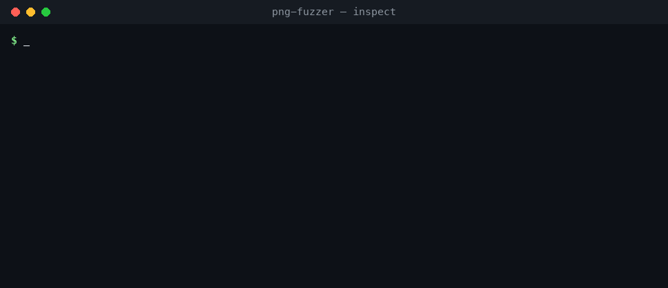
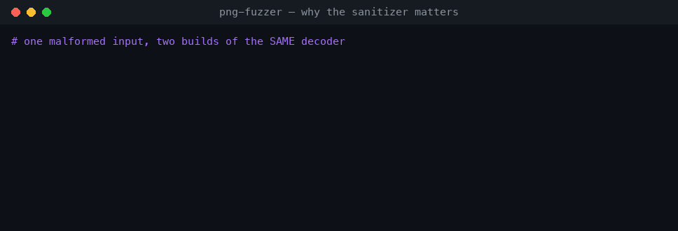

# A guided walkthrough

This is a hands-on tour of the PNG mutation fuzzer, written so you can follow it
top-to-bottom and understand *why* each stage exists — handy for a course
write-up or a first read of the codebase. For the terse command reference, see
the [README](../README.md).

- [1. The mental model](#1-the-mental-model)
- [2. Setup](#2-setup)
- [3. A PNG, byte by byte](#3-a-png-byte-by-byte)
- [4. Inspecting structure (and triaging crashes)](#4-inspecting-structure-and-triaging-crashes)
- [5. How the mutations work](#5-how-the-mutations-work)
- [6. Running a campaign](#6-running-a-campaign)
- [7. Triaging a finding](#7-triaging-a-finding)
- [8. Why the sanitizer matters](#8-why-the-sanitizer-matters)
- [9. The four planted bugs](#9-the-four-planted-bugs)
- [10. Deduplication: the key idea](#10-deduplication-the-key-idea)
- [11. Reproducibility](#11-reproducibility)
- [12. Experiments to try](#12-experiments-to-try)

---

## 1. The mental model

A fuzzer is a loop that throws malformed input at a program and watches for it to
misbehave. Four things have to be true for it to find real bugs:

1. **You can generate lots of "almost valid" inputs.** Fully random bytes get
   rejected immediately; inputs that are *structurally* close to valid get deep
   into the parser before something breaks. → the **seed** + the **mutator**.
2. **The target actually crashes when it does something unsafe.** Normal builds
   silently corrupt memory and carry on. → compile the target under
   **AddressSanitizer / UBSan**.
3. **You can tell a crash happened, and where.** → the **harness** parses the
   sanitizer report.
4. **You don't drown in duplicates.** One shallow bug fires thousands of times. →
   **deduplicate by crash site**.

Everything in this repo is one of those four things.

```
seed ─▶ mutate ─▶ malformed.png ─▶ decoder (ASan/UBSan) ─▶ crash? ─▶ dedup ─▶ save
          ▲                                                                  │
          └───────────────────────────── loop ──────────────────────────────┘
```

---

## 2. Setup

```bash
git clone https://github.com/ashtherz/png-fuzzer.git && cd png-fuzzer
cd target && make && cd ..        # builds the sanitized decoder
python3 corpus/make_seed.py       # writes corpus/seed.png
```

Requirements: a C compiler with ASan/UBSan (`gcc` or `clang`; macOS's `cc` is
fine) and Python 3 (standard library only). No `pip install` needed to run the
fuzzer itself.

---

## 3. A PNG, byte by byte

A PNG is an 8-byte signature followed by a series of *chunks*:

```
signature: 89 50 4E 47 0D 0A 1A 0A
chunk:     [ length : 4 ][ type : 4 ][ data : length ][ CRC : 4 ]
```

- `IHDR` holds the image header — width, height, bit depth, colour type.
- `IDAT` holds the zlib-compressed pixels.
- `IEND` marks the end.
- The `CRC` is an **integrity** check (catches accidental corruption), **not** a
  security control — a decoder that trusts a length or a field before it ever
  checks the CRC is already exploitable.

`corpus/make_seed.py` builds all of this by hand — computing each length and
CRC-32 itself, with no imaging library — so the seed is completely understood.
Every `length`, `type`, and field value is attacker-controlled, and each is a
place a bug can live. Those are exactly the bytes the mutator targets.

---

## 4. Inspecting structure (and triaging crashes)

`png_inspect.py` prints a chunk table. Crucially it parses *defensively* and
never crashes on bad input — so the same tool works on a valid seed **and** on a
saved crash file. Watch it on the seed (all `OK`), then on a crashing input
(a chunk that lies about its length, flagged in red):



That red `LENGTH RUNS PAST EOF` is the whole game in one line: the file *declares*
4,294,967,295 bytes of `IDAT` when only ~150 are present. A decoder that believes
that number will read far past the buffer — which is planted bug #1.

---

## 5. How the mutations work

Every mutation is **named** and reports exactly what it changed, so any crash is
traceable to a byte-level cause. Try one by hand:

```bash
python3 src/mutator.py corpus/seed.png --strategy ihdr_field --seed-rng 3
# -> ihdr_field: colourtype = 255 (0xff)
```

Two families:

| Family | Strategies | Idea |
|--------|-----------|------|
| **Dumb** (format-blind) | `bit_flip`, `byte_flip`, `truncate` | Cheap, random; occasionally lucky. |
| **Structure-aware** (PNG-aware) | `lie_length`, `ihdr_field`, `dup_chunk`, `remove_chunk`, `corrupt_crc` | Understands chunks; corrupts the exact fields a decoder trusts. |

The dispatcher weights the structure-aware strategies ~3× higher because they
reach bugs random flipping almost never does, and **`havoc`** stacks several
mutations onto one input. All randomness comes from a **seeded RNG**, so a run is
exactly reproducible.

> **Why structure-aware wins:** to hit the integer-narrowing bug you need the
> width field to be something like `0x10000`. A random bit-flip lands on that
> value with vanishing probability; `ihdr_field` picks it from a table of nasty
> boundary values on purpose.

---

## 6. Running a campaign

```bash
python3 src/fuzz.py fuzz --iters 4000 --seed 0
```

With `--seed 0` the run is deterministic: it finds all four planted bugs within
the first ~20 iterations, then spends the rest re-triggering and deduplicating
them. Each `NEW` line names the mutation that produced the crash:


Results are written to `crashes/`: one `.png` (the exact input) and one `.txt`
(mutation trace + full sanitizer report + a reproduce command) per unique bug,
plus a rolling `SUMMARY.md`.

---

## 7. Triaging a finding

`repro` replays a saved input and prints the full sanitizer report, then a
one-line verdict mapping it to a CWE and a root cause:


Read the report top-down:

- `heap-buffer-overflow … READ of size 1` — an out-of-bounds **read**.
- `#0 … in chunk_checksum naive_decoder.c:103` — the **crash site**: the exact
  line that did the unsafe access. This is what dedup keys on.
- `allocated by … main naive_decoder.c:123` — where the buffer it overran was
  allocated (the whole-file heap buffer).
- `SUMMARY:` — the one line the harness parses for the site and bug type.

---

## 8. Why the sanitizer matters

Here is the same malformed input fed to two builds of the *same* decoder — the
optimized release build, then the AddressSanitizer build:



The release build prints `decoded ok`. The bug didn't go away — the out-of-bounds
read just landed on adjacent heap memory that happened to be mapped, so nothing
visibly broke. That is precisely why memory-safety bugs survive in the wild for
years. AddressSanitizer puts a poisoned *red-zone* around every allocation and
aborts on the first access into it, turning invisible corruption into a
deterministic, located crash.

```bash
cd target && make release && cd ..     # optimized, NO sanitizers
# feed both builds the same file (see README "Seeing that the bugs are silent")
```

---

## 9. The four planted bugs

`target/naive_decoder.c` is written naively on purpose; each bug lives in its own
function so a report blames exactly one weakness.

| # | Function | Weakness (CWE) | What the file controls | How a mutation reaches it |
|---|----------|----------------|------------------------|---------------------------|
| 1 | `chunk_checksum` | Heap over-read (CWE-125) | A chunk's declared `length` | `lie_length` — declare more bytes than exist |
| 2 | `fill_row_scratch` | Stack buffer overflow (CWE-121/787) | `width` → a byte count written into a 64-byte stack buffer | `ihdr_field` — set width to e.g. 256 |
| 3 | `ihdr_channel_lookup` | OOB read via bad index (CWE-125/129) | `colour_type`, used directly as an array index | `ihdr_field` — set colour type to e.g. 255 |
| 4 | `ihdr_alloc_and_fill` | Integer narrowing → heap write (CWE-190→787) | `width`, narrowed 32→16-bit when sizing the buffer | `ihdr_field` — set width to e.g. `0x10000` |

The common thread: every bug is a value taken from the file and **trusted** —
used as a length, an index, or a size — without a bounds check. That is the
single most common shape of real-world memory-safety vulnerabilities.

---

## 10. Deduplication: the key idea

A shallow bug is hit constantly. In a representative run, **692 crashing inputs
collapsed to just 4 real bugs**. Without dedup the output is unusable.

The signature is the **crash site** — the `file:line` the sanitizer blames,
parsed from the `SUMMARY:` line. The tempting-but-wrong alternative is to key on
the full sanitizer message:

```
==ERROR: AddressSanitizer: heap-buffer-overflow on address 0x61200000018d ...
                                                          ^^^^^^^^^^^^^^^
                                             this address changes every run (ASLR)
```

Key on the message and identical bugs look unique — dozens of false "uniques" for
a handful of real bugs. Key on the *site* (`naive_decoder.c:103`) and they
collapse correctly. This project deliberately does the latter.

---

## 11. Reproducibility

- A fixed `--seed` replays the **exact** sequence of mutations, on any machine.
- Every saved crashing `.png` re-triggers its bug independently of the RNG — so
  findings survive across machines and runs. That's what makes `repro` reliable
  and what lets CI assert, on every push, that all four bugs are still found.

---

## 12. Experiments to try

Good prompts for a write-up or for extending the project:

1. **Strategy ablation.** Run `--strategy bit_flip` vs `--strategy ihdr_field`
   for the same `--iters`. How many unique bugs does each reach? This measures how
   much *structure awareness* is worth.
2. **Seed sensitivity.** Generate a grayscale seed (colour type 0) and compare.
   Which bugs stay reachable? (Reachability is bounded by seed diversity.)
3. **Timeouts.** Add `--timeout 1` and see whether any input is recorded as a
   hang (a denial-of-service finding) rather than a memory crash.
4. **Break the dedup on purpose.** Temporarily key the signature on the full
   sanitizer message and watch the "unique" count explode — then put it back.
5. **Add a fifth bug.** Plant a decompression-bomb / uncontrolled-allocation bug
   (CWE-789) in `naive_decoder.c`, give it its own function, and confirm the
   harness discovers and buckets it with no code changes to the fuzzer.

---

Back to the [README](../README.md) · Browse the [source](../src).
